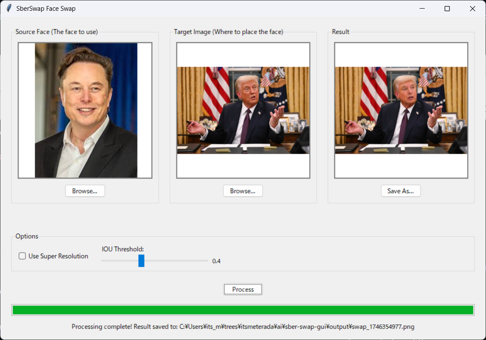

# sber-swap-gui
## AI Face swap GUI app

A Windows GUI application for face swapping using the SberSwap face swapping technology with drag and drop support.

There is a web version under webapp folder if you are using macos/Linux.
See the [README](webapp/README.md) for more information.

The AI inference is done using [ailia SDK](https://github.com/axinc-ai/ailia-models).



## Features

- Simple drag and drop interface
- Swap faces in images
- Super resolution enhancement option for source face image
- Support for both Ailia and ONNX runtime
- Adjustable IOU threshold for face detection

## Requirements

- Python 3.7 or higher
- Required Python packages (installed automatically by setup.py):
  - numpy
  - opencv-python
  - Pillow
  - ailia
  - tkinterdnd2

## Installation

1. Clone or download this repository
2. Run the setup script:

```
python setup.py
```

The setup script will:
- Install the required Python packages
- Download model files (if not already present)
- Create shortcuts and batch files (on Windows)
- Check for required files

## Usage

### Running the Application

On Windows, you can:
- Double-click the desktop shortcut (if created during setup)
- Run the `run_sberswap.bat` batch file
- Run directly with Python:
  ```
  python sber-swap-gui.py
  ```

### Using the Application

1. **Load the Source Face**:
   - Drag and drop an image containing the face you want to use
   - Or click "Browse..." to select an image file

2. **Load the Target Image**:
   - Drag and drop an image where you want to place the face
   - Or click "Browse..." to select an image file

3. **Configure Options** (optional):
   - Super Resolution: Enhances the quality of the swapped face
   - IOU Threshold: Adjust detection sensitivity

4. **Process**:
   - Click the "Process" button to start face swapping
   - Wait for processing to complete

5. **Save Result**:
   - The result will be automatically saved in the `output` directory
   - Click "Save As..." to save it to a custom location

## Troubleshooting

### Missing Models

If model files are missing, the application will download automatically.

### Missing Dependencies

If you see import errors, ensure all dependencies are installed:

```
pip install numpy opencv-python Pillow ailia tkinterdnd2
```

### Face Detection Issues

- If faces are not detected, try adjusting the IOU threshold
- Ensure the source image contains a clearly visible face
- Make sure the target image contains a face similar in position to the source

## Credits

This application is based on the SberSwap face swapping technology and uses models from:
https://github.com/axinc-ai/ailia-models/tree/master/face_swapping/sber-swap

## License

This application is provided for educational purposes only. Please respect privacy and be responsible when using face swapping technology.