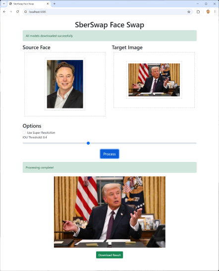

# SberSwap Web Application

SberSwap is a web application that performs face swapping between a source image (the face you want to use) and a target image (where you want to place the face).



## Features

- Browser-based user interface
- Drag-and-drop file uploads
- Automatic model file downloads
- Super Resolution option
- Real-time progress tracking
- Japanese file name support

## System Requirements

- Python 3.7 or higher
- Required Python packages (listed in requirements.txt)
- At least 2GB of RAM (for model loading)

## Installation

### 1. Clone and Setup

```bash
# Create project directory
mkdir webapp
cd webapp

# Create necessary directory structure
mkdir templates static models uploads output
```

### 2. File Structure

```
webapp/
├── app.py
├── requirements.txt
├── templates/
│   └── index.html
├── static/
│   ├── style.css
│   └── app.js
├── models/           # Empty directory (models auto-download)
├── uploads/          # Empty directory
└── output/           # Empty directory
```

### 3. AILIA SDK Setup

pip install ailia

### 4. Install Dependencies

```bash
# Create virtual environment (recommended)
python -m venv venv
source venv/bin/activate  # On Windows: venv\Scripts\activate

# Install packages
pip install -r requirements.txt
```

### 5. Prepare Utils Directory

Copy the utils directory from the original SberSwap code, ensuring these files are included:
- face_detect_crop.py
- face_align.py
- image_infer.py
- masks.py

It is already copied under utils/.

## Usage

### 1. Start the Application

```bash
python sber-swap-web.py
```

### 2. Access via Browser

Navigate to http://localhost:5000

### 3. First-time Model Download

On first run, if model files are missing, a "Download Missing Models" button will appear. Click it to automatically download all required models (approximately 500MB total).

### 4. Performing Face Swap

1. **Source Image**: Upload the face you want to use (drag-and-drop or click)
2. **Target Image**: Upload the image where you want to place the face
3. **Options**:
   - Super Resolution: Apply high-resolution enhancement (increases processing time)
   - IOU Threshold: Face detection precision (0.4 is usually fine)
4. Click **Process** button
5. Once complete, the result will be displayed and downloadable

## Troubleshooting

### Model Download Fails

Manual download option:

```bash
cd models
wget https://storage.googleapis.com/ailia-models/sber-swap/G_unet_2blocks.onnx
wget https://storage.googleapis.com/ailia-models/sber-swap/G_unet_2blocks.onnx.prototxt
# ... other model files
```

### File Upload Errors

- Supported formats: PNG, JPG, JPEG, GIF
- Maximum file size: 16MB
- Check write permissions for uploads directory

### Out of Memory Errors

- Resize large images (>2000x2000) before uploading
- Close other applications to free up memory

## Check Progress Logs

Monitor detailed progress and error messages in the server console:

```bash
# Redirect output to log file
python sber-swap-web.py > app.log 2>&1 &
```

## License

This project is released under the MIT License.

## Credits

- AILIA SDK for model inference
- Flask framework for web interface

## Support

For issues or questions, please use the GitHub Issues section.